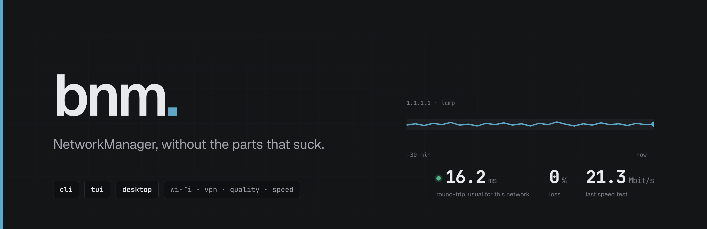
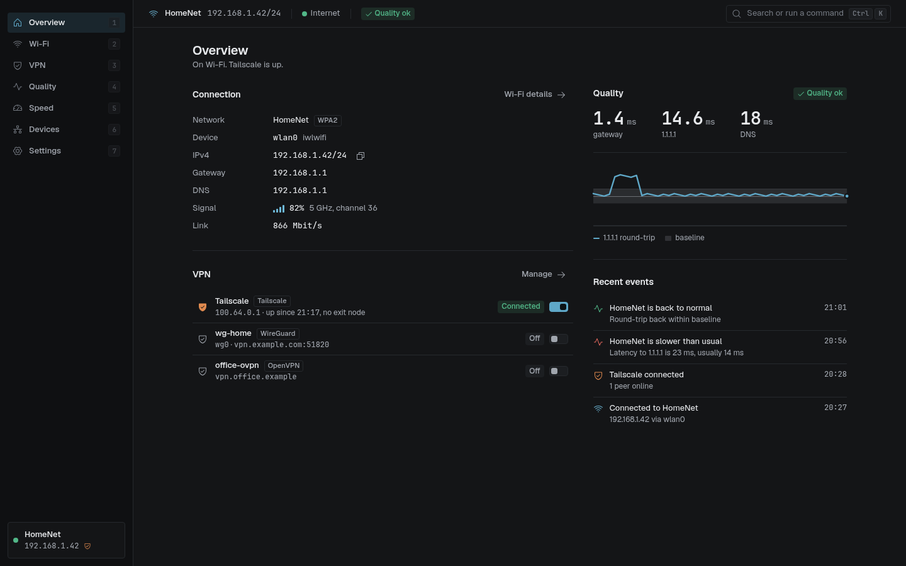
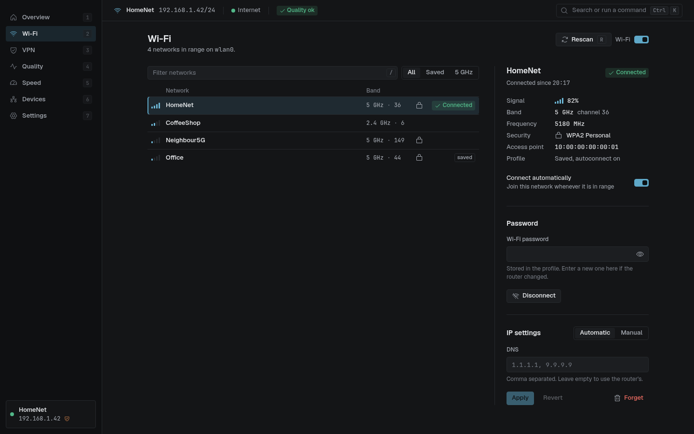
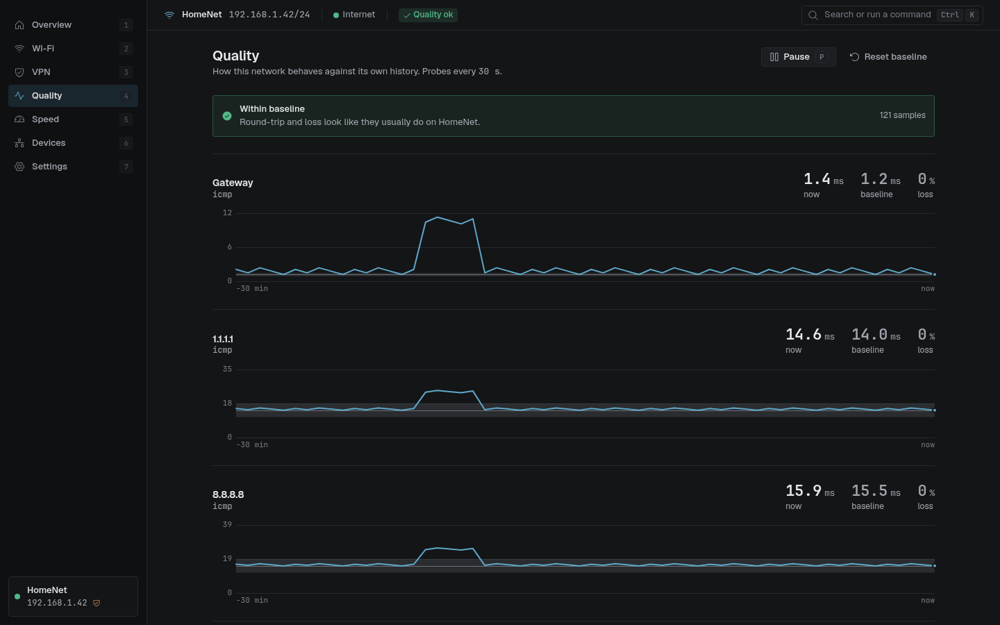
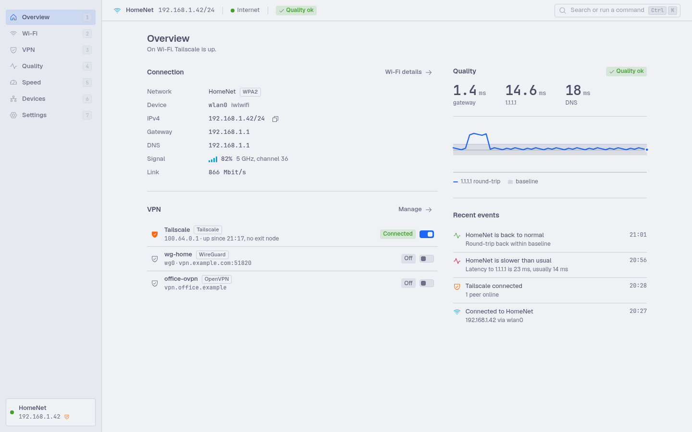

<p align="center">
  
</p>

<p align="center">
  <a href="https://github.com/dopeCape/better-nm/actions/workflows/ci.yml"></a>
  <a href="https://github.com/dopeCape/better-nm/releases"></a>
  
  
</p>

I got tired of `nmtui`. It doesn't refresh, it looks like 1994, and it has no idea that Tailscale exists. `nmcli` is fine if you enjoy remembering flag orders. Neither of them can tell you the one thing you actually want to know when Slack starts stuttering: *is the network slower than it usually is, or is it just Slack?*

So this is bnm. One small daemon that sits on NetworkManager's D-Bus API, and three ways to talk to it: a CLI, a terminal UI that actually updates itself, and a desktop app that doesn't look like a settings panel from a distro installer.

<p align="center">
  
</p>

## What it does that the stock tools don't

**One list for every VPN.** Tailscale, WireGuard, OpenVPN, strongSwan, L2TP, whatever NetworkManager has a plugin for. Same switch, same states, same place. Exit nodes, MagicDNS and Tailscale login live next to your WireGuard tunnels instead of in a separate CLI you have to remember.

**It knows what "normal" is.** Every 30 seconds the daemon pings your gateway and two public anchors and times a DNS lookup. It keeps that per network, builds a baseline, and only calls the network degraded when it's meaningfully worse than *its own* history. 40 ms on hotel Wi-Fi is fine. 40 ms at home when it's usually 12 is not. You get a notification when that happens, and another when it recovers.

**A speed test you don't have to open a browser for.** `bnm speed` hits Cloudflare's endpoints (or your own iperf3 box). It never runs in the background, because a speed test that runs on its own is how you blow through a metered connection.

**Notifications that are actually useful.** Connected, disconnected, "you're connected but there's no internet" (captive portals), internet back, VPN up, VPN down. Roaming between access points is debounced so you don't get spammed.

**It asks for passwords like a real client.** bnm registers as a NetworkManager secret agent, so when a saved password gets rejected or an OpenVPN profile wants a one-time code, the prompt shows up in whatever surface you're using. Headless box? `bnm secrets` lists what's waiting.

**Diagnostics for when you're debugging someone else's router.** Who's on the LAN, what's listening on this host, the routing table, DNS lookups against a specific server, your public IP, and which bridges belong to Docker, Podman or libvirt.

Everything runs as your user. NetworkManager through polkit, Tailscale through its own socket, ICMP through unprivileged ping sockets. There is no `sudo` anywhere in this codebase.

## Install

Grab a package from [releases](https://github.com/dopeCape/better-nm/releases):

| | |
|---|---|
| CLI + TUI + daemon | `bnm` as `.deb`, `.rpm`, Arch package, or a static tarball. AUR: `bnm-bin` |
| Desktop app | `bnm-desktop` as AppImage, `.deb` or `.rpm` (x86_64 and aarch64) |
| Nix | `nix run github:dopeCape/better-nm`, or the flake's NixOS / Home Manager module: `services.bnm.enable = true; services.bnm.desktop = true;` |

Then, optionally, make the daemon a user service so it keeps collecting baselines when nothing is open:

```
bnm daemon install
```

Without that step `bnm` just starts the daemon on demand the first time you run it. Either way it lives on the socket at `$XDG_RUNTIME_DIR/bnm/bnmd.sock`.

From source you need Go 1.25 for the CLI and daemon, and Rust + Node 24 + WebKitGTK 4.1 for the desktop app (`nix develop` has all of it):

```
make build            # bin/bnm, bin/bnmd
make desktop          # bin/bnm-desktop
make install          # ~/.local/bin + a launcher entry
```

## The three surfaces

### `bnm`, the CLI

```
$ bnm status
● Connected to ALHN-F832-5 (wifi via wlp4s0)
  Wi-Fi     ▂▄▆  74%  5 GHz ch 161  WPA2
  IPv4      192.168.1.73/24
  Gateway   192.168.1.254
  Internet  full
  VPN       Tailscale
  Monitor   ok  gateway 1.1 ms · 1.1.1.1 15 ms · 8.8.8.8 15 ms
  Daemon    bnmd 0.1.0  up 3h  NM 1.56.0

$ bnm wifi connect "Cafe Upstairs" --ask
$ bnm vpn up tailscale
$ bnm vpn ts exit-node set hetzner-1
$ bnm vpn add wg ~/Downloads/mullvad-se-sto.conf
$ bnm speed --quick
$ bnm diag devices
$ bnm events --follow
```

Every command that prints something takes `--json`. Exit codes mean things (1 error, 2 usage, 3 daemon unreachable, 4 permission denied), and when NetworkManager says no, you get the polkit or Tailscale hint that fixes it, not a D-Bus error name. The full tree is in [docs/CLI.md](docs/CLI.md).

### `bnm` with no arguments, the TUI

This is the `nmtui` replacement. It's a single window with six tabs, it redraws when the daemon sees something change, and nothing in it makes you press a key to refresh.

```
 bnm   ALHN-F832-5 192.168.1.73  ● full  vpn 1/2  monitor ok                              bnmd 0.1.0
1 Wi-Fi     │Monitor  ok
2 Devices   │network wifi:ALHN-F832-5  ·  every 30s  ·  last sample 8s ago  ·  dns 57 ms
3 VPN       │
4 Monitor   │  anchor             state            rtt now / baseline     loss
5 Speed     │  gateway            ok               1.1 ms / 1.1 ms        0%
6 Diag      │  1.1.1.1            ok               15 ms / 15 ms          0%
            │  8.8.8.8            ok               15 ms / 14 ms          0%
            │
            │gateway  last 60 samples  0.8 ms – 4.4 ms
            │▃▂▂▂▂▂▂▂▂▃▃▂▂▂▂▃▂▂▂▂▃▂▂▂▂▂▂▄▂█▂▂▂▂▂▂▂▂▂▂▂▃▂▂▂▃▂▂▂▃▂▂▂▃▂▄▂▂▂▂
            │
            │1.1.1.1  last 60 samples  14 ms – 17 ms
            │▅▆▄█▆▅▄▅▆▆▅▄▅▆▅▆▆▅▆▅▆▄▅▅▅▅▄▅▅▆▇▆▅▆▄▆▆▆▆▄▅▅▆▅▆▅▅▄▆▆▅▆▆▅▄▅▄▂▂▃
 p pause  R reset baseline  r reload  ? help  e events  q quit                    17:39:21 tejas disconnected
```

`Enter` connects, `f` forgets (it asks first), `r` rescans, `p` on a saved network lets you type a new password without forgetting it, `e` opens the event log, `?` shows the rest.

### `bnm-desktop`

A Tauri app: Rust shell, React front end, your system's WebKitGTK. It talks to the same daemon over the same socket. Frameless, keyboard-first (`Ctrl K` opens a command palette, `1` to `7` switch sections, `/` filters), and it follows your colours.

<p align="center">
  
  
</p>

Theming is a config file, not a settings toggle. `~/.config/bnmdesktop/config.yaml` is watched, so edits apply live:

```yaml
theme: catppuccin-mocha    # dark | light | catppuccin-mocha | catppuccin-latte | gruvbox-dark
                           # nord | tokyo-night | rose-pine | dracula | one-dark | custom
accent: "#f5c2e7"          # optional, overrides the preset's accent
font: "Inter"              # UI font; machine values always use a mono face
mono_font: "JetBrainsMono Nerd Font"
density: compact           # compact | default | comfortable
tray: auto
close_to_tray: true
```

For `theme: custom` you can hand it 16 tokens, point `base16:` at any Base16 scheme file, or point `import:` at a pywal / wallust `colors.json` so the app takes the wallpaper's palette. Precedence is preset, then Base16, then pywal, then your explicit tokens, then `accent`.

<p align="center">
  
</p>

## How the monitoring decides

Because "it feels slow" deserves a real answer.

- A sample is one round every 30 s: three ICMP echoes to the gateway and to each anchor (default `1.1.1.1` and `8.8.8.8`), plus one DNS resolve. On Debian and Ubuntu, which ship without unprivileged ping sockets, the deb drops in a sysctl file; until it applies, probes fall back to TCP connect timing.
- The baseline is the median RTT over a rolling window of 200 samples per network and anchor. Nothing is judged until 40 samples exist; the UI says "learning 12/40" in the meantime.
- Degraded means three consecutive evaluations where the current 10-sample median is more than 2× the baseline *and* more than 20 ms over it, or loss is above 10 % on a network that usually has under 2 %. The gateway alone never triggers it; a public anchor has to agree, so a flaky AP and a flaky ISP both count but a single dead anchor doesn't.
- Recovered needs 10 consecutive good samples, so it doesn't flap.

Networks are keyed by SSID (or the wired profile), which means the same SSID at two locations shares a baseline. That's a known trade-off; `bnm monitor baseline --reset` exists.

## Tailscale, one thing to know

Reading Tailscale state works out of the box. Changing it (connect, disconnect, exit nodes) goes through Tailscale's own socket, which only lets root or a designated operator write. So once, on each machine:

```
sudo tailscale set --operator=$USER
```

NixOS: `services.tailscale.extraSetFlags = [ "--operator=you" ];`. bnm shows this exact hint in the VPN list until it's done, and never tries to escalate on your behalf.

## Layout of the repo

```
internal/core       the vocabulary (CONTEXT.md explains the words) and the interfaces everything else implements
internal/nm         NetworkManager over D-Bus, directly with godbus: no wrapper library, plus the secret agent
internal/vpn        tailscale (LocalAPI), wireguard (NM-native profiles + wg-quick .conf import), nmvpn (any NM plugin)
internal/monitor    probes, the baseline engine, the loop
internal/speed      Cloudflare and iperf3 clients
internal/diag       LAN hosts, ports, routes, DNS, public IP; internal/infra for bridges
internal/daemon     state, event derivation, the bus; internal/api is HTTP/JSON over the socket; internal/client wraps it
internal/cli        cobra; internal/ui/tui is Bubble Tea
desktop/            Tauri 2: src-tauri is the Rust shell, src is React, design/ is the design system and mockups
```

Tests come in three tiers: `make test-race` needs nothing, `make test-integration` runs the NetworkManager adapter against python-dbusmock, and `go test -tags live ./...` does read-only checks against the machine you're on. CI runs the first two plus a Nix build of both packages.

The planning for all of this lives in this repo's issues as a "map" (start at #1); the research behind the bigger decisions is in `docs/research/`. If you're wondering why something is the way it is, that's usually where the answer is.

## Status

v0.1. I run it every day on NixOS with Hyprland, and it's been exercised on Ubuntu in CI. Things I know are missing:

- Enterprise Wi-Fi (802.1X / EAP)
- OpenConnect, NetBird, Mullvad and NordVPN as first-class backends (they show up if NetworkManager knows about them, but no dedicated adapter yet)
- Hotspot creation and Bluetooth tethering
- `wg-quick` scripts with PreUp/PostUp hooks: those can't run without root, so bnm imports the config into NetworkManager instead and tells you which lines it dropped

Bug reports with `bnm --json status` and the tail of `~/.local/state/bnm/bnmd.log` are the fastest way to get something fixed.

## Licence

MIT.
